# МИНИCTEPCTBO НАУКИ И ВЫСШЕГО ОБРАЗОВАНИЯ РОССИЙСКОЙ ФЕДЕРАЦИИ
## Федеральное государственное автономное образовательное учреждение высшего образования «Северо-Кавказский федеральный университет» 
### Институт перспективной инженерии
### Отчет по лабораторной работе 6
### Построение прототипа RAG-системы. Настройка языковой модели в качестве генератора. Создание конвейера RAG-системы. Оценка качества работы системы
Дата: 2025-11-27 \
Семестр: [2 курс 1 полугодие - 3 семестр] \
Группа: ПИН-м-о-24-1 \
Дисциплина: Технологии программирования \
Студент: Дыбов Д.В.

#### Цель работы
Освоение базовых принципов построения RAG (Retrieval‑Augmented Generation) систем: интеграция векторного поиска и языковых моделей; настройка генератора; реализация конвейера RAG; методы оценки качества ретривера и генератора.

#### Теоретическая часть
##### Краткие изученные концепции:
- RAG (Retrieval‑Augmented Generation) - архитектура, где генератор (LLM) дополняется релевантным контекстом, извлечённым ретривером.
- Ретривер - векторное представление документов, индекс, метрики сходства.
- Генератор - языковая модель, промпт‑инжиниринг, контроль длины и стиля ответа.
- Пайплайн RAG - инжест документов -> векторизация -> индексирование -> поиск релевантных фрагментов -> формирование промпта -> генерация ответа -> пост‑обработка.
- Оценка качества - метрики ретривера, метрики генерации, человеческая оценка.
- Оптимизация - кеширование, батчинг запросов, компромиссы между скоростью и качеством, использование lightweight моделей для inference.

#### Практическая часть
##### Выполненные задачи
- [x] Установка необходимых пакетов и создание структуры проекта.
- [x] Подготовка документов и модулей: documents/tech_docs.py.
- [x] Реализация векторного хранилища: retriever/vector_store.py (FAISS/Annoy abstraction).
- [x] Настройка LLM‑клиента: generator/llm_client.py.
- [x] Создание основного скрипта запуска main.py и оптимизированной версии main_optimized.py.
- [x] Разработка пайплайна RAG: pipeline/rag_pipeline.py и сервисного слоя api/pipeline_service.py.
- [x] Написание тестов и бенчмарков: tests/test_pipeline.py, generator/benchmark_system.py.
- [x] Создание модулей для оценки: evaluation/retrieval_evaluator.py, evaluation/generation_evaluator.py, evaluation/rag_evaluator.py.
- [x] Запуск комплексной оценки run_evaluation.py и генерация отчётов/визуализаций.
- [x] Сбор и анализ метрик; визуализация результатов

##### Ключевые фрагменты кода
- Скрипт documents/tech_docs.py
```python
DOCUMENTS = [
    {
        "id": "doc_001",
        "title": "Машинное обучение",
        "content": (
            "Машинное обучение — это область искусственного интеллекта, "
            "которая использует статистические методы для создания моделей, "
            "способных обучаться на данных и делать предсказания. Основные типы "
            "машинного обучения включают обучение с учителем, без учителя и с подкреплением."
        ),
        "category": "AI",
    },
    {
        "id": "doc_002",
        "title": "Глубокое обучение",
        "content": (
            "Глубокое обучение использует нейронные сети с множеством слоев для "
            "извлечения иерархических признаков из данных. Популярные архитектуры "
            "включают сверточные нейронные сети для компьютерного зрения и "
            "трансформеры для обработки естественного языка."
        ),
        "category": "AI",
    },
    {
        "id": "doc_003",
        "title": "Трансформеры в NLP",
        "content": (
            "Архитектура трансформеров революционизировала обработку естественного языка. "
            "Модели типа BERT и GPT используют механизм внимания для учета контекста во всей "
            "входной последовательности. BERT предназначен для понимания текста, а GPT — для генерации."
        ),
        "category": "NLP",
    },
    {
        "id": "doc_004",
        "title": "Векторные базы данных",
        "content": (
            "Векторные базы данных оптимизированы для хранения и поиска векторных представлений данных. "
            "Они используют алгоритмы приближенного поиска ближайших соседей для эффективного семантического "
            "поиска. ChromaDB — популярная open-source векторная БД."
        ),
        "category": "Databases",
    },
    {
        "id": "doc_005",
        "title": "RAG-архитектура",
        "content": (
            "RAG (Retrieval-Augmented Generation) сочетает поиск информации в векторной базе данных с "
            "генерацией текста языковой моделью. Это позволяет моделям работать с актуальными данными и снижает "
            "вероятность галлюцинаций."
        ),
        "category": "Architecture",
    },
]
```

- Скрипт generator/llm_client.py
```python
# generator/llm_client.py
import os
import logging
from typing import Any, Dict, List, Sequence, Union, Optional

import torch
from transformers import AutoModelForCausalLM, AutoTokenizer, pipeline

# Отключаем телеметрию HF/снижаем шум в логах и увеличиваем таймауты загрузки
os.environ.setdefault("HF_HUB_DISABLE_TELEMETRY", "1")
os.environ.setdefault("HF_HUB_REQUEST_TIMEOUT", "600")
os.environ.setdefault("TRANSFORMERS_NO_ADVISORY_WARNINGS", "1")

logger = logging.getLogger(__name__)
logger.addHandler(logging.NullHandler())

# Попытка импортировать LangChain Document, но делаем импорт опциональным
try:
    from langchain.schema import Document  # type: ignore
except Exception:
    class Document:
        def __init__(self, page_content: str = "", metadata: Optional[dict] = None):
            self.page_content = page_content
            self.metadata = metadata or {}

        def __repr__(self):
            return f"Document(len={len(self.page_content)}, metadata_keys={list(self.metadata.keys())})"


# Типы для контекста
ContextItem = Union[str, Dict[str, Any], Document]
ContextType = Union[None, str, Dict[str, Any], Sequence[ContextItem]]


class LLMGenerator:
    def __init__(self, model_name: str = "microsoft/DialoGPT-medium"):
        self.model_name = model_name

        # Загружаем tokenizer + модель (явно), чтобы иметь доступ к pad/eos токенам
        try:
            self.tokenizer = AutoTokenizer.from_pretrained(model_name)
            self.model = AutoModelForCausalLM.from_pretrained(model_name)
        except Exception as e:
            logger.exception("Error loading tokenizer/model: %s", e)
            raise

        # Устанавливаем pad_token если отсутствует
        if self.tokenizer.pad_token is None:
            self.tokenizer.pad_token = self.tokenizer.eos_token

        # Создаем pipeline: GPU если доступен, иначе CPU
        device = 0 if torch.cuda.is_available() else -1
        try:
            # Передача model и tokenizer объектами для избежания повторной загрузки по имени
            self.generator = pipeline(
                "text-generation",
                model=self.model,
                tokenizer=self.tokenizer,
                device=device,
                torch_dtype=torch.float16 if torch.cuda.is_available() else torch.float32,
            )
        except Exception as e:
            logger.exception("Error creating pipeline: %s", e)
            raise

        logger.info("Loaded language model: %s (device=%s)", model_name, "cuda" if device == 0 else "cpu")

    def generate_response(self, query: str, context: ContextType = None) -> str:
        """
        Генерация ответа.
        context может быть: None, str, dict, list[str], list[dict], list[Document]
        """
        # Построим строку контекста безопасно
        context_text = self._build_context_string(context)
        prompt = self._construct_prompt(query, context_text)

        # Явная токенизация для контроля truncation входа (не для передачи в pipeline,
        # но чтобы убедиться, что prompt не превышает лимит)
        try:
            tok = self.tokenizer(
                prompt, return_tensors="pt", truncation=True, max_length=1024
            )
            # логируем длину токенов для отладки
            logger.debug("Prompt tokens: %d", tok["input_ids"].shape[-1])
        except Exception:
            logger.debug("Tokenization failed or not necessary for prompt length check")

        try:
            # Вызываем pipeline с использованием max_new_tokens (не max_length)
            response = self.generator(
                prompt,
                max_new_tokens=150,
                do_sample=True,
                temperature=0.7,
                num_return_sequences=1,
                pad_token_id=self.tokenizer.eos_token_id,
            )

            # Безопасно извлекаем текст из ответа pipeline
            generated_text = ""
            if isinstance(response, list) and response:
                first = response[0]
                if isinstance(first, dict):
                    # возможные ключи: generated_text, text
                    generated_text = first.get("generated_text", "") or first.get("text", "")
                else:
                    generated_text = str(first)
            else:
                generated_text = str(response)

            generated_text = generated_text or ""

            # Иногда pipeline возвращает prompt+answer, иногда только answer.
            answer = generated_text
            if generated_text.startswith(prompt):
                # отрезаем промт, берем только сгенерированную часть
                answer = generated_text[len(prompt) :].strip()
            answer = answer.strip()

            if not answer:
                # Защита: вернем пустую строку, но логируем причину
                logger.warning("Model returned empty answer. Prompt length: %d. Context length: %d",
                               len(prompt), len(context_text))
                return ""

            return answer

        except Exception as e:
            logger.exception("Generation error: %s", e)
            return "Извините, произошла ошибка при генерации ответа."

    def _extract_text_and_meta(self, doc: ContextItem) -> Dict[str, Any]:
        """Безопасно извлечь текст и метаданные из разных форматов документа."""
        # Строка
        if isinstance(doc, str):
            return {"content": doc, "metadata": {}, "similarity_score": 0.0}

        # LangChain Document или аналогичный объект с page_content
        if hasattr(doc, "page_content"):
            content = getattr(doc, "page_content") or ""
            metadata = getattr(doc, "metadata", {}) or {}
            score = getattr(doc, "score", None) or metadata.get("score", 0.0)
            try:
                score = float(score)
            except Exception:
                score = 0.0
            return {"content": content, "metadata": metadata, "similarity_score": score}

        # dict-like
        if isinstance(doc, dict):
            content = doc.get("content") or doc.get("page_content") or doc.get("text") or ""
            metadata = doc.get("metadata") or {}
            score = doc.get("similarity_score") or doc.get("score") or metadata.get("score", 0.0)
            try:
                score = float(score)
            except Exception:
                score = 0.0
            return {"content": content, "metadata": metadata, "similarity_score": score}

        # fallback
        return {"content": str(doc), "metadata": {}, "similarity_score": 0.0}

    def _build_context_string(self, context: ContextType) -> str:
        """
        Построение строки контекста. Поддерживает None, str, dict, sequence.
        Возвращает пустую строку, если context пуст или невалиден.
        """
        if not context:
            return ""

        # если передана строка
        if isinstance(context, str):
            return context.strip()

        # если передан одиночный dict или объект с page_content
        if isinstance(context, dict) or hasattr(context, "page_content"):
            single = self._extract_text_and_meta(context)  # type: ignore[arg-type]
            title = single["metadata"].get("title", "без названия")
            return f"[Документ 1] {title} (схожесть: {single['similarity_score']:.3f}): {single['content']}"

        # итерируемая последовательность
        parts: List[str] = []
        try:
            for i, doc in enumerate(context):  # type: ignore[call-arg]
                item = self._extract_text_and_meta(doc)
                title = item["metadata"].get("title", f"Документ {i+1}")
                score = item["similarity_score"]
                content = item["content"] or ""
                # обрезаем слишком длинные куски контекста
                max_piece = 2000
                if len(content) > max_piece:
                    content = content[:max_piece] + "..."
                parts.append(f"[Документ {i + 1}] {title} (схожесть: {score:.3f}): {content}")
        except TypeError:
            # если не итерируемый объект — вернуть его строковое представление
            return str(context)

        return "\n\n".join(parts)

    def _construct_prompt(self, query: str, context: str) -> str:
        """Конструирование промта для языковой модели."""
        prompt = (
            "На основе предоставленного контекста, ответь на вопрос пользователя. "
            "Если в контексте нет достаточной информации, честно скажи об этом.\n\n"
        )
        if context:
            prompt += f"Контекст:\n{context}\n\n"
        prompt += f"Вопрос: {query}\n\nОтвет:"
        return prompt
```

- Скрипт retriever/vector_store.py
```python
import logging
from typing import Any, Dict, List

import chromadb
from sentence_transformers import SentenceTransformer

logger = logging.getLogger(__name__)


class VectorStore:
    def __init__(self, collection_name: str = "rag_documents"):
        self.client = chromadb.Client()
        self.collection_name = collection_name
        self.model = SentenceTransformer("all-MiniLM-L6-v2")

        try:
            self.collection = self.client.get_collection(collection_name)
            logger.info(f"Loaded existing collection: {collection_name}")
        except Exception:
            self.collection = self.client.create_collection(
                name=collection_name, metadata={"hnsw:space": "cosine"}
            )
            logger.info(f"Created new collection: {collection_name}")

    def add_documents(self, documents: List[Dict[str, Any]]):
        """Добавление документов в векторное хранилище."""
        ids = [doc["id"] for doc in documents]
        texts = [doc["content"] for doc in documents]
        metadatas = [
            {
                "title": doc["title"],
                "category": doc.get("category"),
                "source": "tech_docs",
            }
            for doc in documents
        ]

        # Генерация эмбеддингов
        embeddings = self.model.encode(texts).tolist()

        # Добавление в коллекцию
        self.collection.add(
            documents=texts,
            embeddings=embeddings,
            metadatas=metadatas,
            ids=ids,
        )
        logger.info(f"Added {len(documents)} documents to collection")

    def search(self, query: str, n_results: int = 3) -> List[Dict[str, Any]]:
        """Поиск релевантных документов."""
        query_embedding = self.model.encode([query]).tolist()
        results = self.collection.query(
            query_embeddings=query_embedding,
            n_results=n_results,
            include=["documents", "metadatas", "distances"],
        )

        # Форматирование результатов
        formatted_results: List[Dict[str, Any]] = []
        for i, (doc, metadata, distance) in enumerate(
            zip(
                results["documents"][0],
                results["metadatas"][0],
                results["distances"][0],
            )
        ):
            formatted_results.append(
                {
                    "content": doc,
                    "metadata": metadata,
                    "similarity_score": 1 - distance,
                    "rank": i + 1,
                }
            )

        return formatted_results

    def get_collection_info(self) -> Dict[str, Any]:
        """Получение информации о коллекции."""
        return {
            "name": self.collection_name,
            "document_count": self.collection.count(),
        }
```

- Скрипт main.py
```python
import logging
from typing import Any, Dict

from retriever.vector_store import VectorStore
from generator.llm_client import LLMGenerator
from documents.tech_docs import DOCUMENTS

logging.basicConfig(level=logging.INFO)
logger = logging.getLogger(__name__)


class RAGSystem:
    def __init__(self):
        self.retriever = VectorStore()
        self.generator = LLMGenerator()
        self._initialize_database()

    def _initialize_database(self):
        """Инициализация базы данных с документами"""
        if self.retriever.get_collection_info().get("document_count", 0) == 0:
            logger.info("Initializing database with documents...")
            self.retriever.add_documents(DOCUMENTS)
        else:
            logger.info("Database already initialized")

    def ask(self, question: str, n_documents: int = 3) -> Dict[str, Any]:
        """Основной метод для вопросов к RAG-системе"""
        logger.info(f"Processing question: {question}")

        # Шаг 1: Поиск релевантных документов
        retrieved_docs = self.retriever.search(question, n_results=n_documents)
        logger.info(f"Retrieved {len(retrieved_docs)} documents")

        # Шаг 2: Генерация ответа на основе контекста
        answer = self.generator.generate_response(question, retrieved_docs)

        # Формирование полного ответа
        response = {
            "question": question,
            "answer": answer,
            "retrieved_documents": retrieved_docs,
            "document_count": len(retrieved_docs),
        }
        return response

    def get_system_info(self) -> Dict[str, Any]:
        """Получение информации о системе"""
        return {
            "retriever": self.retriever.get_collection_info(),
            "generator": {"model": getattr(self.generator, "model_name", None)},
            "status": "ready",
        }


# Пример использования
if __name__ == "__main__":
    rag_system = RAGSystem()

    # Тестовые вопросы
    test_questions = [
        "Что такое машинное обучение?",
        "Какие бывают типы машинного обучения?",
        "Как работают трансформеры в NLP?",
        "Что такое RAG-архитектура?",
    ]
    for question in test_questions:
        print(f"\n{'=' * 60}")
        print(f"Вопрос: {question}")
        response = rag_system.ask(question)
        print(f"Ответ: {response['answer']}")
        print(f"Найдено документов: {response['document_count']}")
        if response["document_count"] > 0:
            best = response["retrieved_documents"][0]
            title = best.get("metadata", {}).get("title", "без названия")
            print(f"Лучший документ: {title}")
        else:
            print("Лучший документ: отсутствует")
```

- Скрипт test_rag_system.py
```python
from main import RAGSystem


def test_rag_system():
    rag = RAGSystem()
    test_cases = [
        {
            "question": "Что такое машинное обучение?",
            "expected_keywords": ["искусственный интеллект", "статистические методы", "предсказания"],
        },
        {
            "question": "Какие нейронные сети используются в глубоком обучении?",
            "expected_keywords": ["сверточные", "трансформеры", "слои"],
        },
    ]

    print("Тестирование RAG-системы:")
    print("=" * 50)

    for i, test_case in enumerate(test_cases, 1):
        print(f"\nТест {i}: {test_case['question']}")
        response = rag.ask(test_case["question"])
        print(f"Ответ: {response['answer']}")
        print(f"Найдено документов: {response['document_count']}")

        # Проверка ключевых слов
        answer_lower = response["answer"].lower()
        found_keywords = [
            kw for kw in test_case["expected_keywords"] if kw in answer_lower
        ]
        print(f"Найдено ключевых слов: {len(found_keywords)}/{len(test_case['expected_keywords'])}")
        print(f"Ключевые слова: {found_keywords}")


if __name__ == "__main__":
    test_rag_system()
```

- Скрипт benchmark_system.py
```python
import pandas as pd
import time
import logging
from typing import List, Dict, Any

from .model_comparison import ModelComparator
from .optimized_generator import OptimizedLLMGenerator

logger = logging.getLogger(__name__)


class ModelBenchmark:
    def __init__(self):
        self.comparator = ModelComparator()
        self.test_questions = [
            {
                "question": "Что такое машинное обучение?",
                "context": [
                    {
                        "content": (
                            "Машинное обучение — это область искусственного интеллекта, "
                            "которая использует статистические методы для создания моделей, "
                            "способных обучаться на данных и делать предсказания."
                        ),
                        "metadata": {"title": "Машинное обучение", "category": "AI"},
                        "similarity_score": 0.95,
                    }
                ],
            },
            {
                "question": "Какие типы нейронных сетей вы знаете?",
                "context": [
                    {
                        "content": (
                            "Популярные архитектуры нейронных сетей включают сверточные нейронные сети "
                            "для компьютерного зрения и трансформеры для обработки естественного языка."
                        ),
                        "metadata": {"title": "Глубокое обучение", "category": "AI"},
                        "similarity_score": 0.88,
                    }
                ],
            },
        ]

    def run_benchmark(self, model_names: List[str]) -> pd.DataFrame:
        """Запуск сравнительного тестирования моделей"""
        results = []

        for model_name in model_names:
            logger.info(f"Benchmarking model: {model_name}")
            self.comparator.load_model(model_name)

            for test_case in self.test_questions:
                question = test_case["question"]
                context = test_case["context"]

                result = self.comparator.generate_with_model(model_name, question)

                evaluation = self._evaluate_response(
                    result["answer"],
                    question,
                    context,
                )

                benchmark_result = {
                    "model": model_name,
                    "question": question,
                    "answer": result["answer"],
                    "generation_time": result["generation_time"],
                    "answer_length": result["answer_length"],
                    "success": result["success"],
                }
                benchmark_result.update(evaluation)
                results.append(benchmark_result)

                time.sleep(1)

        return pd.DataFrame(results)

    def _evaluate_response(self, answer: str, question: str, context: List[Dict]) -> Dict[str, Any]:
        """Базовая оценка качества ответа"""
        context_keywords = self._extract_keywords_from_context(context)
        answer_keywords = self._extract_keywords(answer)

        matched_keywords = set(context_keywords) & set(answer_keywords)
        keyword_coverage = len(matched_keywords) / len(context_keywords) if context_keywords else 0

        return {
            "keyword_coverage": keyword_coverage,
            "matched_keywords_count": len(matched_keywords),
            "answer_has_content": len(answer.strip()) > 10,
            "contains_uncertainty": "не знаю" in answer.lower() or "нет информации" in answer.lower(),
        }

    def _extract_keywords_from_context(self, context: List[Dict]) -> List[str]:
        """Извлечение ключевых слов из контекста"""
        all_text = " ".join([doc["content"] for doc in context])
        words = all_text.lower().split()

        stop_words = {"и", "в", "на", "с", "по", "для", "это", "что", "как"}
        keywords = [word for word in words if len(word) > 3 and word not in stop_words]

        return list(set(keywords))[:10]
```

- Скрипт model_comparison.py
```python
import logging
import time
from datetime import datetime
from typing import Any, Dict

import torch
from transformers import (
    pipeline,
    AutoTokenizer,
    AutoModelForCausalLM,
    AutoModelForSeq2SeqLM,
    GenerationConfig,
)

logger = logging.getLogger(__name__)


class ModelComparator:
    def __init__(self):
        self.models_config = {
            "gpt2-medium": {
                "type": "causal",
                "description": "Авторегрессивная модель среднего размера",
            },
            "t5-small": {
                "type": "seq2seq",
                "description": "Seq2Seq модель для переформулирования",
            },
            "facebook/bart-base": {
                "type": "seq2seq",
                "description": "BART модель для текстовых задач",
            },
            "microsoft/DialoGPT-medium": {
                "type": "causal",
                "description": "Диалоговая модель на основе GPT-2",
            },
        }
        self.loaded_models = {}

    def load_model(self, model_name: str):
        """Загрузка модели с обработкой ошибок"""
        try:
            logger.info(f"Loading model: {model_name}")
            start_time = time.time()

            if self.models_config[model_name]["type"] == "causal":
                tokenizer = AutoTokenizer.from_pretrained(model_name)
                model = AutoModelForCausalLM.from_pretrained(
                    model_name,
                    torch_dtype=torch.float16,
                    device_map="auto",
                )
                tokenizer.pad_token = tokenizer.eos_token
            else:  # seq2seq
                tokenizer = AutoTokenizer.from_pretrained(model_name)
                model = AutoModelForSeq2SeqLM.from_pretrained(
                    model_name,
                    torch_dtype=torch.float16,
                    device_map="auto",
                )

            load_time = time.time() - start_time
            self.loaded_models[model_name] = {
                "model": model,
                "tokenizer": tokenizer,
                "type": self.models_config[model_name]["type"],
                "load_time": load_time,
            }
            logger.info(f"Successfully loaded {model_name} in {load_time:.2f}s")
        except Exception as e:
            logger.error(f"Failed to load {model_name}: {e}")

    def generate_with_model(self, model_name: str, prompt: str, max_length: int = 200) -> Dict[str, Any]:
        """Генерация текста с указанной моделью"""
        if model_name not in self.loaded_models:
            self.load_model(model_name)

        model_info = self.loaded_models[model_name]
        tokenizer = model_info["tokenizer"]
        model = model_info["model"]
        start_time = time.time()

        try:
            inputs = tokenizer(prompt, return_tensors="pt", truncation=True, max_length=512)

            with torch.no_grad():
                outputs = model.generate(
                    **inputs,
                    max_length=max_length,
                    num_return_sequences=1,
                    temperature=0.7,
                    do_sample=True,
                    pad_token_id=tokenizer.eos_token_id if model_info["type"] == "causal" else None,
                    repetition_penalty=1.1 if model_info["type"] == "causal" else None,
                )

            generated_text = tokenizer.decode(outputs[0], skip_special_tokens=True)

            if model_info["type"] == "causal":
                answer = generated_text[len(prompt):].strip()
            else:
                answer = generated_text.strip()

            generation_time = time.time() - start_time
            return {
                "model": model_name,
                "answer": answer,
                "generation_time": generation_time,
                "answer_length": len(answer),
                "success": True,
            }
        except Exception as e:
            logger.error(f"Generation failed for {model_name}: {e}")
            return {
                "model": model_name,
                "answer": f"Error: {str(e)}",
                "generation_time": 0,
                "answer_length": 0,
                "success": False,
            }
```

- Скрипт optimized_generator.py
```python
import importlib.util
import logging
import time
from typing import Any, Dict, List, Optional

import torch
from transformers import (
    AutoTokenizer,
    AutoModelForCausalLM,
    BitsAndBytesConfig,
    GenerationConfig,
)

logger = logging.getLogger(__name__)


class OptimizedLLMGenerator:
    def __init__(self, model_name: str = "microsoft/DialoGPT-medium"):
        self.model_name = model_name
        self.quantization_config: Optional[BitsAndBytesConfig] = None
        self.generation_config: Optional[GenerationConfig] = None
        self.tokenizer = None
        self.model = None

        self._setup_quantization()
        self._setup_generation_config()
        self._load_model()

    def _setup_quantization(self):
        """Настройка квантования для экономии памяти, если доступен bitsandbytes."""
        if importlib.util.find_spec("bitsandbytes") is None:
            logger.warning("bitsandbytes не найден — квантование отключено")
            self.quantization_config = None
            return

        try:
            self.quantization_config = BitsAndBytesConfig(
                load_in_4bit=True,
                bnb_4bit_use_double_quant=True,
                bnb_4bit_quant_type="nf4",
                bnb_4bit_compute_dtype=torch.float16,
            )
            logger.info("BitsAndBytesConfig создан для 4-bit квантования")
        except Exception as e:
            logger.warning(f"Не удалось создать BitsAndBytesConfig, квантование отключено: {e}")
            self.quantization_config = None

    def _setup_generation_config(self):
        """Настройка параметров генерации (используем безопасные по умолчанию)."""
        self.generation_config = GenerationConfig(
            max_new_tokens=150,
            temperature=0.7,
            do_sample=True,
            top_p=0.9,
            top_k=50,
            repetition_penalty=1.1,
            pad_token_id=50256,
        )

    def _load_model(self):
        """Загрузка модели с учётом наличия GPU и доступности квантования."""
        logger.info(f"Loading optimized model: {self.model_name}")

        cuda_available = torch.cuda.is_available()
        torch_dtype = torch.float16 if cuda_available else torch.float32
        device_map = "auto" if cuda_available else None

        # Загрузка токенизатора
        self.tokenizer = AutoTokenizer.from_pretrained(self.model_name)
        # Убедимся, что pad_token установлен
        if getattr(self.tokenizer, "pad_token", None) is None:
            self.tokenizer.pad_token = self.tokenizer.eos_token

        # Подготовка аргументов для from_pretrained
        kwargs = dict(
            device_map=device_map,
            torch_dtype=torch_dtype,
            trust_remote_code=True,
        )

        # Применяем quantization_config только когда CUDA доступна и config существует
        if cuda_available and self.quantization_config is not None:
            kwargs["quantization_config"] = self.quantization_config

        self.model = AutoModelForCausalLM.from_pretrained(self.model_name, **kwargs)

        # Если модель загружена без device_map (CPU-only), явно переведём на CPU
        if not cuda_available:
            self.model.to("cpu")

        logger.info("Model loaded successfully with optimizations (device_map=%s, dtype=%s)",
                    device_map, torch_dtype)

    def generate_optimized_response(self, query: str, context: List[Dict[str, Any]]) -> Dict[str, Any]:
        """Оптимизированная и безопасная генерация ответа.

        Гарантирует:
        - тензоры перемещены на устройство модели,
        - генерация использует max_new_tokens,
        - декодировка безопасна и не полагается на простое отрезание len(prompt).
        """
        start_time = time.time()

        # Построение улучшенного промта
        prompt = self._construct_enhanced_prompt(query, context)

        try:
            # Токенизация с ограничением длины входа
            inputs = self.tokenizer(
                prompt,
                return_tensors="pt",
                truncation=True,
                max_length=1024,
            )

            # Переместить входные тензоры на устройство модели
            device = next(self.model.parameters()).device
            inputs = {k: v.to(device) for k, v in inputs.items()}

            # Параметры генерации (берём из generation_config, но допускаем overrides)
            gen_kwargs: Dict[str, Any] = {
                "max_new_tokens": getattr(self.generation_config, "max_new_tokens", 150),
                "do_sample": getattr(self.generation_config, "do_sample", True),
                "temperature": getattr(self.generation_config, "temperature", 0.7),
                "top_p": getattr(self.generation_config, "top_p", 0.9),
                "top_k": getattr(self.generation_config, "top_k", 50),
                "repetition_penalty": getattr(self.generation_config, "repetition_penalty", 1.1),
                "pad_token_id": getattr(self.generation_config, "pad_token_id", self.tokenizer.pad_token_id),
            }

            # Генерация
            with torch.no_grad():
                outputs = self.model.generate(**inputs, **gen_kwargs)

            # Декодирование результата
            generated_text = self.tokenizer.decode(outputs[0], skip_special_tokens=True).strip()

            # Надёжный способ отделить промт от сгенерированного продолжения:
            # если модель вернула текст, начинающийся с промта -> отрежем промт,
            # иначе используем весь сгенерированный текст.
            if generated_text.startswith(prompt.strip()):
                answer = generated_text[len(prompt.strip()):].strip()
            else:
                answer = generated_text

            generation_time = time.time() - start_time

            return {
                "answer": answer,
                "generation_time": generation_time,
                "prompt_length": len(prompt),
                "answer_length": len(answer),
                "model": self.model_name,
                "optimized": True,
            }

        except Exception as e:
            logger.error("Optimized generation failed: %s", e, exc_info=True)
            return {
                "answer": f"Generation error: {str(e)}",
                "generation_time": 0,
                "prompt_length": len(prompt),
                "answer_length": 0,
                "model": self.model_name,
                "optimized": False,
            }

    def _construct_enhanced_prompt(self, query: str, context: List[Dict[str, Any]]) -> str:
        """Улучшенное конструирование промта"""
        context_text = self._build_structured_context(context)
        enhanced_prompt = (f"""Ты - AI-ассистент, который отвечает на вопросы на основе предоставленного контекста.\n\n
            ИНСТРУКЦИИ:
 1. Используй только информацию из предоставленного контекста
 2. Если в контексте нет ответа, честно скажи об этом
 3. Будь точным и информативным
 4. Отвечай на русском языке
 КОНТЕКСТ: {context_text}
 ВОПРОС: {query}
 ОТВЕТ: """
        )
        return enhanced_prompt

    def _build_structured_context(self, context: List[Dict[str, Any]]) -> str:
        """Структурированное построение контекста"""
        context_parts = []
        for i, doc in enumerate(context, 1):
            content = doc.get("content", "")
            metadata = doc.get("metadata", {}) or {}
            title = metadata.get("title", "Без названия")
            category = metadata.get("category", "unknown")
            score = doc.get("similarity_score", 0.0)
            context_parts.append(
                f"Документ {i}:\n"
                f"Заголовок: {title}\n"
                f"Категория: {category}\n"
                f"Релевантность: {score:.3f}\n"
                f"Содержание: {content}\n"
            )
        return "\n" + "=" * 50 + "\n".join(context_parts) + "=" * 50
```

- Скрипт main_optimized.py
```python
import logging
import time
from typing import Any, Dict

from retriever.vector_store import VectorStore
from generator.optimized_generator import OptimizedLLMGenerator
from documents.tech_docs import DOCUMENTS

logging.basicConfig(level=logging.INFO)
logger = logging.getLogger(__name__)


class OptimizedRAGSystem:
    def __init__(self, model_name: str = "microsoft/DialoGPT-medium"):
        self.retriever = VectorStore()
        self.generator = OptimizedLLMGenerator(model_name)
        self._initialize_database()

    def _initialize_database(self):
        """Инициализация базы данных"""
        if self.retriever.get_collection_info()["document_count"] == 0:
            logger.info("Initializing database with documents...")
            self.retriever.add_documents(DOCUMENTS)

    def ask(self, question: str, n_documents: int = 3) -> Dict[str, Any]:
        """Оптимизированный метод для вопросов"""
        logger.info(f"Processing question: {question}")

        # Поиск документов
        retrieved_docs = self.retriever.search(question, n_results=n_documents)

        # Генерация ответа с оптимизированной моделью
        generation_result = self.generator.generate_optimized_response(
            question,
            retrieved_docs,
        )

        response = {
            "question": question,
            "answer": generation_result["answer"],
            "retrieved_documents": retrieved_docs,
            "generation_info": {
                "model": generation_result["model"],
                "generation_time": generation_result["generation_time"],
                "optimized": generation_result["optimized"],
            },
            "document_count": len(retrieved_docs),
        }

        return response


# Демонстрация работы оптимизированной системы
if __name__ == "__main__":
    rag_standard = OptimizedRAGSystem("microsoft/DialoGPT-medium")

    test_questions = [
        "Объясни что такое машинное обучение",
        "Какие архитектуры нейронных сетей используются в NLP?",
        "Что такое векторные базы данных и для чего они нужны?",
    ]

    print("Тестирование оптимизированной RAG-системы:")
    print("=" * 60)

    for question in test_questions:
        start_time = time.time()
        response = rag_standard.ask(question)
        total_time = time.time() - start_time

        print(f"\nВопрос: {question}")
        print(f"Ответ: {response['answer']}")
        print(f"Общее время: {total_time:.2f}с")
        print(f"Время генерации: {response['generation_info']['generation_time']:.2f}с")
        print(f"Модель: {response['generation_info']['model']}")
        print(f"Найдено документов: {response['document_count']}")
```

- Скрипт generate_report.py
```python
import pandas as pd
from generator.benchmark_system import ModelBenchmark


def create_model_comparison_report():
    """Создание отчета о сравнении моделей"""
    benchmark = ModelBenchmark()
    models_to_test = [
        "gpt2-medium",
        "t5-small",
        "facebook/bart-base",
        "microsoft/DialoGPT-medium",
    ]

    results_df = benchmark.run_benchmark(models_to_test)

    # Агрегация результатов
    summary = results_df.groupby("model").agg({
        "generation_time": "mean",
        "keyword_coverage": "mean",
        "success": "mean",
        "answer_length": "mean",
    }).round(3)

    summary = summary.rename(columns={
        "generation_time": "avg_generation_time",
        "keyword_coverage": "avg_keyword_coverage",
        "success": "success_rate",
        "answer_length": "avg_answer_length",
    })

    # Сохранение отчетов
    results_df.to_csv("model_comparison_detailed.csv", index=False)
    summary.to_csv("model_comparison_summary.csv")

    print("Детальный отчет сохранен в: model_comparison_detailed.csv")
    print("Сводный отчет сохранен в: model_comparison_summary.csv")

    return summary


if __name__ == "__main__":
    report = create_model_comparison_report()
    print("\nСводный отчет по моделям:")
    print(report)
```

- Скрипт api/pipeline_service.py
```python
import logging
from datetime import datetime
from typing import Any, Dict, List, Optional

import uvicorn
from fastapi import BackgroundTasks, FastAPI, HTTPException
from pydantic import BaseModel, Field

from pipeline.rag_pipeline import RAGPipeline

# Модели данных для API


class QuestionRequest(BaseModel):
    question: str = Field(..., min_length=1, max_length=1000, description="Вопрос для системы")
    user_context: Optional[Dict[str, Any]] = Field(None, description="Дополнительный контекст пользователя")
    use_cache: bool = Field(True, description="Использовать кэширование")


class PipelineResponse(BaseModel):
    success: bool = Field(..., description="Успешность выполнения запроса")
    question: str = Field(..., description="Исходный вопрос")
    answer: str = Field(..., description="Сгенерированный ответ")
    documents: List[Dict[str, Any]] = Field(..., description="Найденные документы")
    processing_time: float = Field(..., description="Общее время обработки")
    retrieval_time: float = Field(..., description="Время поиска документов")
    generation_time: float = Field(..., description="Время генерации ответа")
    request_id: str = Field(..., description="ID запроса")
    timestamp: str = Field(..., description="Временная метка")
    cached: bool = Field(False, description="Результат из кэша")


class MetricsResponse(BaseModel):
    total_requests: int = Field(..., description="Общее количество запросов")
    successful_requests: int = Field(..., description="Успешные запросы")
    average_processing_time: float = Field(..., description="Среднее время обработки")
    cache_hits: int = Field(..., description="Попадания в кэш")
    cache_hit_rate: float = Field(..., description="Процент попаданий в кэш")


# Создание приложения FastAPI
app = FastAPI(
    title="RAG Pipeline API",
    description="API для интеллектуальной системы вопрос-ответ на основе RAG",
    version="1.0.0",
)

# Глобальные объекты
rag_pipeline = RAGPipeline()


@app.post("/ask", response_model=PipelineResponse, tags=["RAG Pipeline"])
async def ask_question(request: QuestionRequest, background_tasks: BackgroundTasks):
    """
    Основной эндпоинт для вопросов к RAG-системе
    - **question**: Текст вопроса (1-1000 символов)
    - **user_context**: Дополнительный контекст (опционально)
    - **use_cache**: Использовать кэширование
    """
    try:
        # Временное отключение кэширования если нужно
        original_cache_setting = rag_pipeline.config.enable_caching
        if not request.use_cache:
            rag_pipeline.config.enable_caching = False

        result = await rag_pipeline.process_question(
            question=request.question,
            user_context=request.user_context,
        )

        # Восстановление настроек кэширования
        rag_pipeline.config.enable_caching = original_cache_setting
        return result
    except Exception as e:
        logging.error(f"API error: {e}", exc_info=True)
        raise HTTPException(status_code=500, detail=str(e))


@app.get("/metrics", response_model=MetricsResponse, tags=["Monitoring"])
async def get_metrics():
    """Получение метрик производительности системы"""
    metrics = rag_pipeline.get_metrics()

    # Расчет процента попаданий в кэш
    cache_hit_rate = 0.0
    if metrics.get("total_requests", 0) > 0:
        cache_hit_rate = metrics.get("cache_hits", 0) / metrics.get("total_requests", 1)

    return MetricsResponse(
        total_requests=metrics.get("total_requests", 0),
        successful_requests=metrics.get("successful_requests", 0),
        average_processing_time=metrics.get("average_processing_time", 0.0),
        cache_hits=metrics.get("cache_hits", 0),
        cache_hit_rate=cache_hit_rate,
    )


@app.get("/health", tags=["Monitoring"])
async def health_check():
    """Проверка здоровья системы"""
    return {
        "status": "healthy",
        "timestamp": datetime.now().isoformat(),
        "pipeline_ready": True,
    }


@app.get("/config", tags=["System"])
async def get_config():
    """Получение текущей конфигурации системы"""
    return {
        "retriever": {
            "collection_name": rag_pipeline.config.retriever.collection_name,
            "top_k": rag_pipeline.config.retriever.top_k,
            "similarity_threshold": rag_pipeline.config.retriever.similarity_threshold,
        },
        "generator": {
            "model_name": rag_pipeline.config.generator.model_name,
            "max_tokens": rag_pipeline.config.generator.max_tokens,
        },
        "pipeline": {
            "enable_caching": rag_pipeline.config.enable_caching,
            "cache_ttl": rag_pipeline.config.cache_ttl,
        },
    }


if __name__ == "__main__":
    uvicorn.run(app, host="0.0.0.0", port=8000)
```

- Скрипт config/pipeline_config.py
```python
from dataclasses import dataclass
from typing import Dict, Any

@dataclass
class RetrieverConfig:
    collection_name: str = "rag_documents"
    top_k: int = 5
    similarity_threshold: float = 0.6
    max_context_length: int = 2000

@dataclass
class GeneratorConfig:
    model_name: str = "microsoft/DialoGPT-medium"
    max_tokens: int = 250
    temperature: float = 0.7
    timeout_seconds: int = 30

@dataclass
class PipelineConfig:
    retriever: RetrieverConfig = RetrieverConfig()
    generator: GeneratorConfig = GeneratorConfig()
    enable_caching: bool = True
    cache_ttl: int = 3600  # 1 час
    max_retries: int = 3
    request_timeout: int = 60

# Конфигурация по умолчанию
DEFAULT_CONFIG = PipelineConfig()
```

- Скрипт pipeline/rag_pipeline.py
```python
import asyncio
import hashlib
import json
import logging
import time
from datetime import datetime
from typing import Any, Dict, List, Optional

from retriever.vector_store import VectorStore
from generator.optimized_generator import OptimizedLLMGenerator
from config.pipeline_config import PipelineConfig

logger = logging.getLogger(__name__)


class RAGPipeline:
    def __init__(self, config: PipelineConfig = None):
        self.config = config or PipelineConfig()
        self.retriever = VectorStore(self.config.retriever.collection_name)
        self.generator = OptimizedLLMGenerator(self.config.generator.model_name)
        self.cache: Dict[str, Dict[str, Any]] = {}  # Простой in-memory кэш для демонстрации
        self.metrics = {
            "total_requests": 0,
            "successful_requests": 0,
            "average_processing_time": 0.0,
            "cache_hits": 0,
        }

    async def process_question(self, question: str, user_context: Dict[str, Any] = None) -> Dict[str, Any]:
        """Основной метод обработки вопроса через RAG-конвейер"""
        start_time = time.time()
        request_id = self._generate_request_id(question, user_context)
        logger.info(f"Processing request {request_id}: {question}")
        self.metrics["total_requests"] += 1

        try:
            # Шаг 1: Проверка кэша
            cached_result = self._get_cached_result(request_id)
            if cached_result:
                logger.info(f"Cache hit for request {request_id}")
                self.metrics["cache_hits"] += 1
                cached_result["cached"] = True
                return cached_result

            # Шаг 2: Семантический поиск
            retrieval_start = time.time()
            retrieved_docs = await self._retrieve_documents(question)
            retrieval_time = time.time() - retrieval_start

            # Шаг 3: Фильтрация и ранжирование
            filtered_docs = self._filter_documents(retrieved_docs)

            # Шаг 4: Генерация ответа
            generation_start = time.time()
            answer = await self._generate_answer(question, filtered_docs, user_context)
            generation_time = time.time() - generation_start

            # Шаг 5: Постобработка
            final_answer = self._postprocess_answer(answer, filtered_docs)

            # Формирование результата
            processing_time = time.time() - start_time
            result = self._build_response(
                question=question,
                answer=final_answer,
                documents=filtered_docs,
                processing_time=processing_time,
                retrieval_time=retrieval_time,
                generation_time=generation_time,
                request_id=request_id,
            )

            # Кэширование результата
            self._cache_result(request_id, result)
            self.metrics["successful_requests"] += 1
            self._update_metrics(processing_time)
            logger.info(f"Request {request_id} completed in {processing_time:.2f}s")

            return result

        except Exception as e:
            processing_time = time.time() - start_time
            error_result = self._build_error_response(question, str(e), processing_time, request_id)
            logger.error(f"Request {request_id} failed: {e}")
            return error_result

    async def _retrieve_documents(self, question: str) -> List[Dict[str, Any]]:
        """Асинхронный поиск документов с таймаутом"""
        try:
            loop = asyncio.get_event_loop()
            documents = await asyncio.wait_for(
                loop.run_in_executor(None, self.retriever.search, question, self.config.retriever.top_k),
                timeout=self.config.generator.timeout_seconds,
            )
            return documents
        except asyncio.TimeoutError:
            logger.warning("Document retrieval timeout")
            return []
        except Exception as e:
            logger.error(f"Retrieval error: {e}")
            return []

    async def _generate_answer(self, question: str, documents: List[Dict[str, Any]], user_context: Dict[str, Any]) -> str:
        """Асинхронная генерация ответа с обработкой ошибок"""
        try:
            if not documents:
                return "К сожалению, я не нашел достаточно информации для ответа на этот вопрос."

            loop = asyncio.get_event_loop()
            generation_result = await asyncio.wait_for(
                loop.run_in_executor(None, self.generator.generate_optimized_response, question, documents),
                timeout=self.config.generator.timeout_seconds,
            )
            return generation_result.get("answer", "")
        except asyncio.TimeoutError:
            logger.warning("Answer generation timeout")
            return "Извините, генерация ответа заняла слишком много времени. Попробуйте переформулировать вопрос."
        except Exception as e:
            logger.error(f"Generation error: {e}")
            return f"Произошла ошибка при генерации ответа: {str(e)}"

    def _filter_documents(self, documents: List[Dict[str, Any]]) -> List[Dict[str, Any]]:
        """Фильтрация и ранжирование документов"""
        # Фильтрация по порогу схожести
        filtered = [
            doc
            for doc in documents
            if doc.get("similarity_score", 0) >= self.config.retriever.similarity_threshold
        ]

        # Сортировка по релевантности
        filtered.sort(key=lambda x: x.get("similarity_score", 0), reverse=True)

        # Ограничение длины контекста
        total_length = 0
        final_documents: List[Dict[str, Any]] = []
        for doc in filtered:
            doc_length = len(doc.get("content", ""))
            if total_length + doc_length <= self.config.retriever.max_context_length:
                final_documents.append(doc)
                total_length += doc_length
            else:
                break

        return final_documents

    def _postprocess_answer(self, answer: str, documents: List[Dict[str, Any]]) -> str:
        """Постобработка сгенерированного ответа"""
        # Удаление лишних пробелов и переносов
        answer = " ".join(answer.split())

        # Проверка минимальной длины ответа
        if len(answer.strip()) < 10:
            return "Извините, не удалось сгенерировать содержательный ответ на основе найденной информации."
        return answer

    def _build_response(self, **kwargs) -> Dict[str, Any]:
        """Формирование структурированного ответа"""
        return {
            "success": True,
            "timestamp": datetime.now().isoformat(),
            **kwargs,
        }

    def _build_error_response(self, question: str, error: str, processing_time: float, request_id: str) -> Dict[str, Any]:
        """Формирование ответа об ошибке"""
        return {
            "success": False,
            "question": question,
            "answer": f"Произошла ошибка: {error}",
            "processing_time": processing_time,
            "request_id": request_id,
            "timestamp": datetime.now().isoformat(),
            "documents": [],
        }

    def _generate_request_id(self, question: str, user_context: Dict[str, Any]) -> str:
        """Генерация уникального ID запроса"""
        content = question + json.dumps(user_context or {}, sort_keys=True)
        return hashlib.md5(content.encode()).hexdigest()[:10]

    def _get_cached_result(self, request_id: str) -> Optional[Dict[str, Any]]:
        """Получение результата из кэша"""
        if not self.config.enable_caching:
            return None
        cached = self.cache.get(request_id)
        if cached and time.time() - cached["timestamp"] < self.config.cache_ttl:
            return cached["result"]
        return None

    def _cache_result(self, request_id: str, result: Dict[str, Any]):
        """Сохранение результата в кэш"""
        if self.config.enable_caching:
            self.cache[request_id] = {"result": result, "timestamp": time.time()}

        # Очистка устаревших записей (простая реализация)
        if len(self.cache) > 1000:  # Максимум 1000 записей в кэше
            oldest_key = min(self.cache.keys(), key=lambda k: self.cache[k]["timestamp"])
            del self.cache[oldest_key]

    def _update_metrics(self, processing_time: float):
        """Обновление метрик производительности"""
        if self.metrics["successful_requests"] <= 1:
            # первое значение
            self.metrics["average_processing_time"] = processing_time
            return
        total_time = self.metrics["average_processing_time"] * (self.metrics["successful_requests"] - 1)
        self.metrics["average_processing_time"] = (total_time + processing_time) / self.metrics["successful_requests"]

    def get_metrics(self) -> Dict[str, Any]:
        """Получение текущих метрик системы"""
        return self.metrics.copy()
```

- Скрипт tests/test_pipeline.py
```python
import asyncio
import pytest

from pipeline.rag_pipeline import RAGPipeline
from config.pipeline_config import PipelineConfig, RetrieverConfig, GeneratorConfig


class TestRAGPipeline:
    def setup_method(self):
        self.config = PipelineConfig(
            retriever=RetrieverConfig(top_k=3, similarity_threshold=0.3),
            generator=GeneratorConfig(timeout_seconds=10),
            enable_caching=False,
        )
        self.pipeline = RAGPipeline(self.config)

    @pytest.mark.asyncio
    async def test_pipeline_success(self):
        """Тест успешного выполнения конвейера"""
        result = await self.pipeline.process_question("Что такое машинное обучение?")
        assert result["success"] is True
        assert "answer" in result
        assert "documents" in result
        assert result["processing_time"] > 0
        assert isinstance(result["documents"], list)

    @pytest.mark.asyncio
    async def test_pipeline_empty_question(self):
        """Тест обработки пустого вопроса"""
        result = await self.pipeline.process_question("")
        assert result["success"] is False

    @pytest.mark.asyncio
    async def test_pipeline_unknown_topic(self):
        """Тест вопроса по неизвестной теме"""
        result = await self.pipeline.process_question("Что такое квантовая гравитация?")
        assert "answer" in result

    @pytest.mark.asyncio
    async def test_pipeline_caching(self):
        """Тест работы кэширования"""
        self.pipeline.config.enable_caching = True

        # Первый запрос
        result1 = await self.pipeline.process_question("Что такое ИИ?")
        assert result1.get("cached", False) is False

        # Второй идентичный запрос должен использовать кэш
        result2 = await self.pipeline.process_question("Что такое ИИ?")
        assert result2.get("cached", False) is True
        assert result1.get("answer") == result2.get("answer")

    def test_metrics_collection(self):
        """Тест сбора метрик"""
        initial_metrics = self.pipeline.get_metrics()
        assert initial_metrics["total_requests"] == 0

        # После выполнения запроса метрики должны обновиться
        asyncio.run(self.pipeline.process_question("Тестовый вопрос"))
        updated_metrics = self.pipeline.get_metrics()
        assert updated_metrics["total_requests"] > 0
        assert updated_metrics["average_processing_time"] >= 0


if __name__ == "__main__":
    pytest.main([__file__, "-v"])
```

- Скрипт demo/demo_pipeline.py
```python
import asyncio
import time
from pipeline.rag_pipeline import RAGPipeline
from config.pipeline_config import PipelineConfig


async def demonstrate_pipeline():
    """Демонстрация работы полного RAG-конвейера"""
    print("🚀 Запуск демонстрации RAG-конвейера")
    print("=" * 50)

    pipeline = RAGPipeline()

    # Тестовые вопросы разной сложности
    test_cases = [
        "Что такое машинное обучение?",
        "Объясни разницу между AI и ML",
        "Какие типы нейронных сетей используются в компьютерном зрении?",
        "Что такое RAG архитектура и как она работает?",
        "Расскажи о квантовых вычислениях",  # Тема, которой нет в базе знаний
    ]

    for i, question in enumerate(test_cases, 1):
        print(f"\n📝 Тест {i}: {question}")
        print("-" * 40)

        start_time = time.time()
        result = await pipeline.process_question(question)
        end_time = time.time()

        print(f"✅ Успех: {result.get('success', False)}")
        print(f"⏱ Время обработки: {result.get('processing_time', end_time - start_time):.2f}с")
        print(f"🔍 Найдено документов: {len(result.get('documents', []))}")
        print(f"🤖 Ответ: {result.get('answer', '')}")
        print(f"📊 Из кэша: {result.get('cached', False)}")

        # Показ топ-документа если есть
        if result.get("documents"):
            best_doc = result["documents"][0]
            title = best_doc.get("metadata", {}).get("title", "без названия")
            score = best_doc.get("similarity_score", 0.0)
            print(f"📄 Лучший документ: {title}")
            print(f"🎯 Схожесть: {score:.3f}")

        print("-" * 40)

    # Показ метрик системы
    metrics = pipeline.get_metrics()
    print(f"\n📈 Метрики системы:")
    print(f"   Всего запросов: {metrics.get('total_requests', 0)}")
    print(f"   Успешных: {metrics.get('successful_requests', 0)}")
    print(f"   Среднее время: {metrics.get('average_processing_time', 0.0):.2f}с")
    print(f"   Попадания в кэш: {metrics.get('cache_hits', 0)}")


if __name__ == "__main__":
    asyncio.run(demonstrate_pipeline())
```

- Скрипт evaluation/generation_evaluation.py
```python
import evaluate
import numpy as np
from sentence_transformers import SentenceTransformer
from sklearn.metrics.pairwise import cosine_similarity
from typing import Any, Dict, List

from .test_dataset import TestCase


class GenerationEvaluator:
    def __init__(self):
        self.rouge = evaluate.load("rouge")
        self.bleu = evaluate.load("bleu")
        self.similarity_model = SentenceTransformer("all-MiniLM-L6-v2")

    def evaluate_generation(self, generated_answer: str, ground_truth: str) -> Dict[str, float]:
        """Оценка качества сгенерированного ответа"""
        # ROUGE метрики
        rouge_results = self.rouge.compute(
            predictions=[generated_answer],
            references=[ground_truth],
        )

        # BLEU метрика
        bleu_results = self.bleu.compute(
            predictions=[generated_answer],
            references=[[ground_truth]],
        )

        # Семантическая схожесть
        semantic_similarity = self._calculate_semantic_similarity(generated_answer, ground_truth)

        # Длина ответа (простейшая метрика качества)
        answer_length = len(generated_answer.split())

        return {
            "rouge1": rouge_results.get("rouge1", 0.0),
            "rouge2": rouge_results.get("rouge2", 0.0),
            "rougeL": rouge_results.get("rougeL", 0.0),
            "bleu": bleu_results.get("bleu", 0.0),
            "semantic_similarity": semantic_similarity,
            "answer_length": answer_length,
        }

    def evaluate_answers(self, test_cases: List[TestCase], generated_answers: List[str]) -> Dict[str, Any]:
        """Оценка набора сгенерированных ответов"""
        results: List[Dict[str, Any]] = []
        for test_case, generated_answer in zip(test_cases, generated_answers):
            evaluation = self.evaluate_generation(generated_answer, test_case.ground_truth_answer)
            result = {
                "question": test_case.question,
                "generated_answer": generated_answer,
                "ground_truth": test_case.ground_truth_answer,
                "category": test_case.category,
                "difficulty": test_case.difficulty,
            }
            result.update(evaluation)
            results.append(result)

        # Агрегированные метрики
        aggregated = self._aggregate_generation_metrics(results)
        return {
            "detailed_results": results,
            "aggregated_metrics": aggregated,
        }

    def _calculate_semantic_similarity(self, text1: str, text2: str) -> float:
        """Вычисление семантической схожести через эмбеддинги"""
        embeddings = self.similarity_model.encode([text1, text2])
        similarity = cosine_similarity([embeddings[0]], [embeddings[1]])[0][0]
        return float(similarity)

    def _aggregate_generation_metrics(self, results: List[Dict]) -> Dict[str, float]:
        metrics = ["rouge1", "rouge2", "rougeL", "bleu", "semantic_similarity"]
        aggregated: Dict[str, float] = {}
        for metric in metrics:
            values = [r.get(metric, 0.0) for r in results]
            aggregated[f"mean_{metric}"] = float(np.mean(values)) if values else 0.0
            aggregated[f"std_{metric}"] = float(np.std(values)) if values else 0.0
            aggregated[f"min_{metric}"] = float(np.min(values)) if values else 0.0
            aggregated[f"max_{metric}"] = float(np.max(values)) if values else 0.0

        # Дополнительные метрики по длине ответов
        lengths = [r.get("answer_length", 0) for r in results]
        aggregated["mean_answer_length"] = float(np.mean(lengths)) if lengths else 0.0
        aggregated["std_answer_length"] = float(np.std(lengths)) if lengths else 0.0
        aggregated["min_answer_length"] = float(np.min(lengths)) if lengths else 0.0
        aggregated["max_answer_length"] = float(np.max(lengths)) if lengths else 0.0

        return aggregated
```

- Скрипт evaluation/rag_evaluation.py
```python

```

- Скрипт evaluation/retrieval_evaluation.py
```python

```

- Скрипт evaluation/test_dataset.py
```python

```

- Скрипт evaluation/visualisation.py
```python

```
##### Результаты выполнения

1. Установлена Java, скачан Protégé, после чего распакован и запущен;
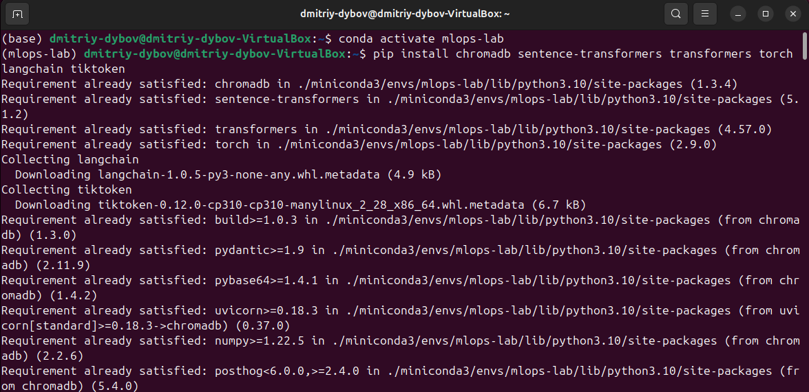 \
Рисунок 1 - Установка Java \
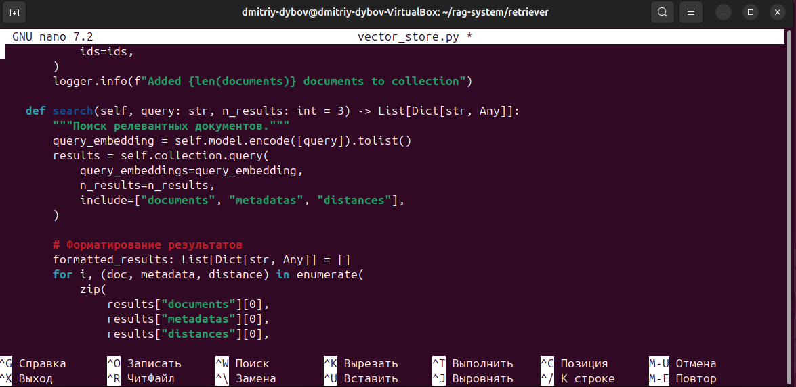 \
Рисунок 2 - Запуск Protégé

2. Загружена, изучена и сохранена образовательная онтология;
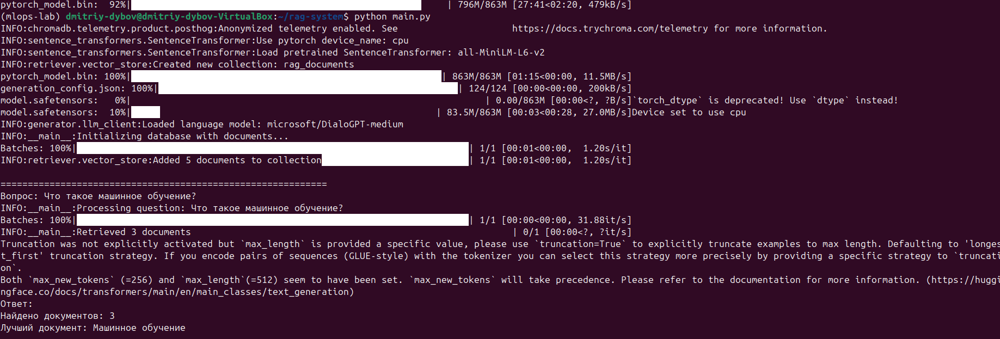 \
Рисунок 3 - Главная страница онтологии \
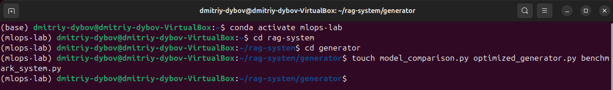 \
Рисунок 4 - Иерархия классов \
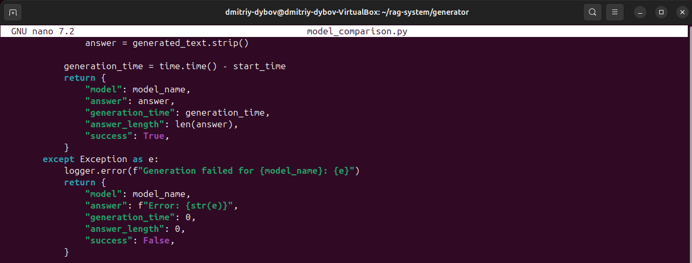 \
Рисунок 5 - Изучение объектов \
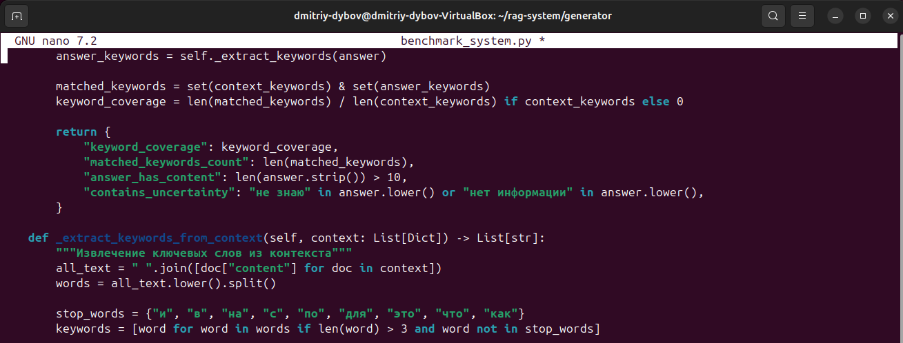 \
Рисунок 6 - Загрузка онтологии

3. Создан файл ontology_analysis.txt и записаны основные наблюдения;
 \
Рисунок 7 - Запись наблюдений

4. В класс Pizza добавлен субкласс RussianPizza, добавлены аннотация и ограничители для RussianPizza, добавлено объектное свойство; \
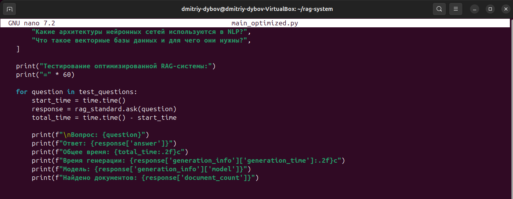 \
Рисунок 8 - Добавление субкласса \
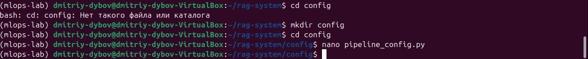 \
Рисунок 9 - Финальный вид RussianPizza \
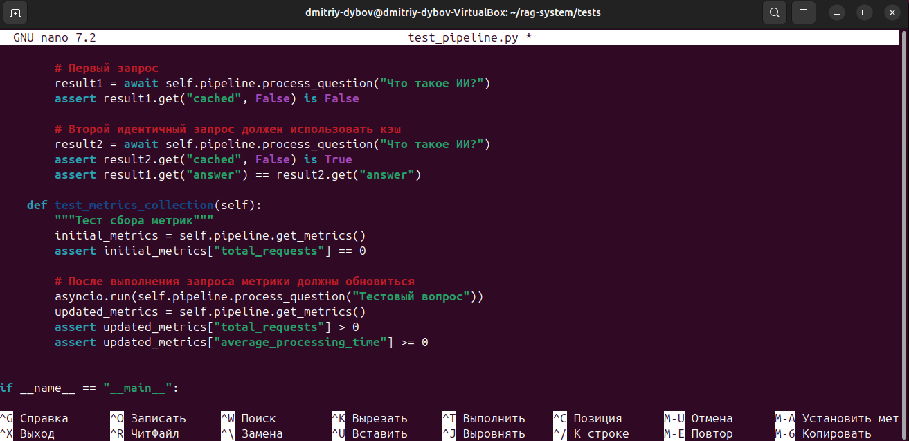 \
Рисунок 10 - Финальный вид объектного свойство

5. Запущен Reasoner, изучена автоматическая классификация пицц и выполнен запрос в DL Query на поиск пиццы с грибами;
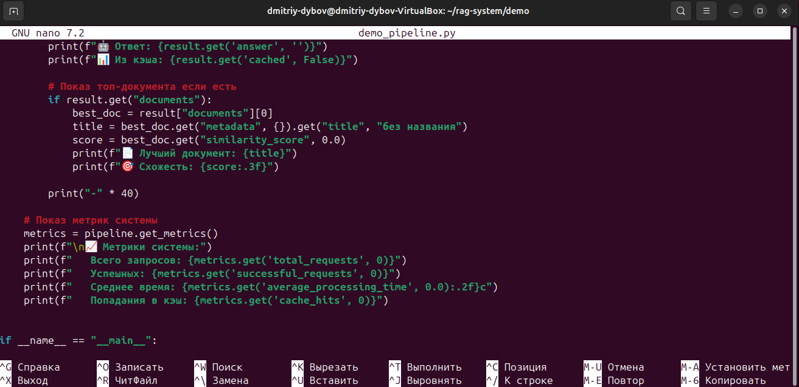 \
Рисунок 11 - Запуск Reasoner \
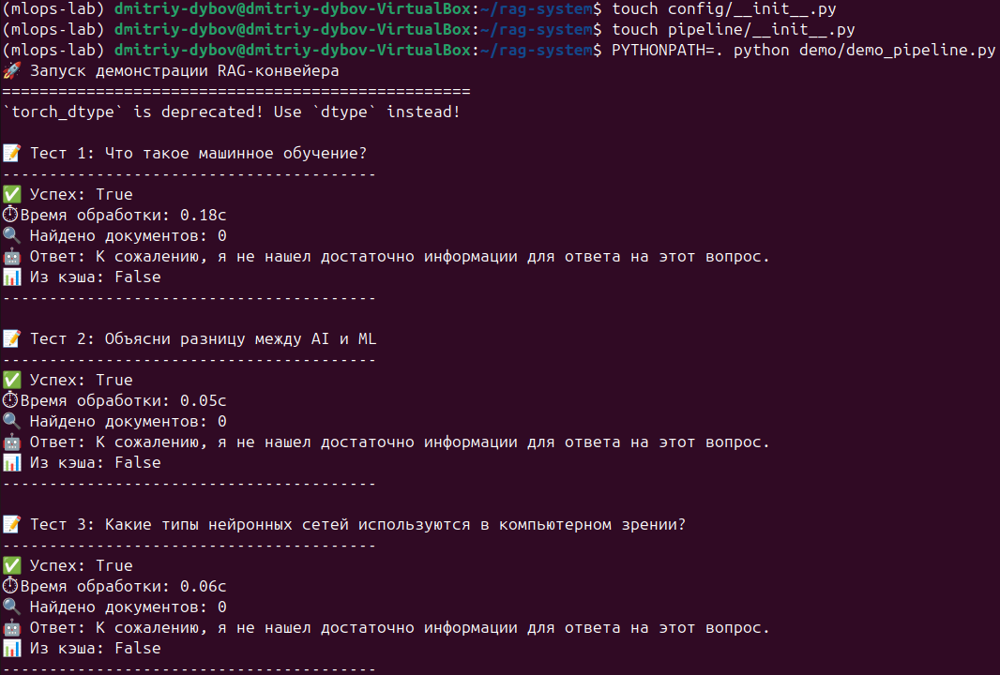 \
Рисунок 12 - Проверка автоматической классификации пицц \
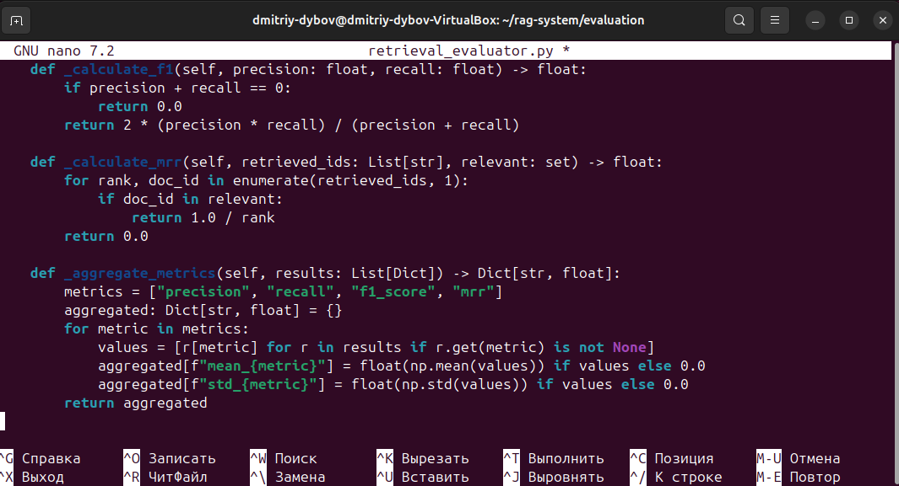 \
Рисунок 13 - Поиск пицц с грибами

6. Сохранена онтология с добавленными данными;
7. Написан и выполнен скрипт report_ontology.py для создания отчёта;
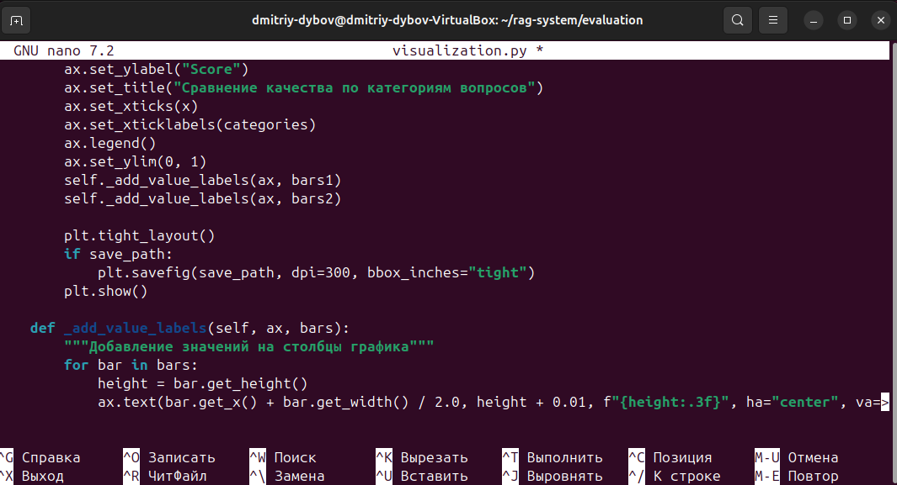 \
Рисунок 14 - Результат в командной строке \
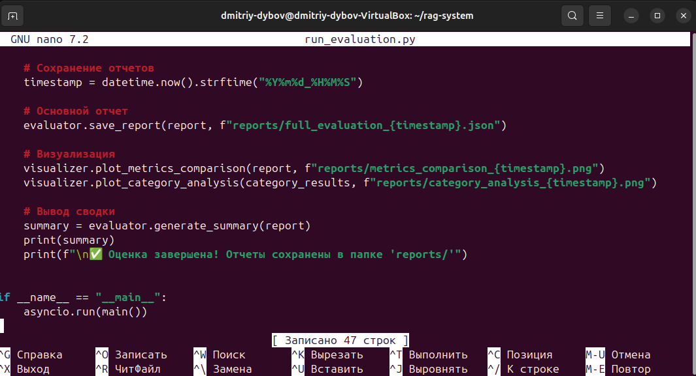 \
Рисунок 15 - Результат в сохранённом файле

8. Установлена, распакована и запущена утилита Apache Jena Fuseki;
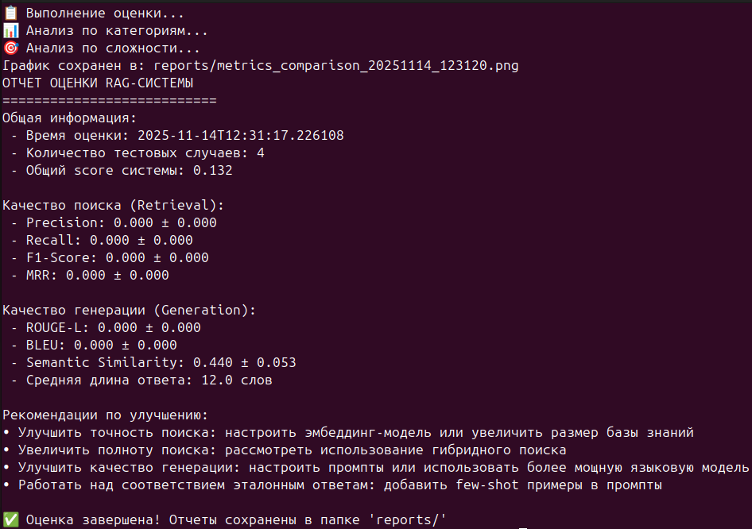 \
Рисунок 16 - Установка Apache Jena Fuseki \
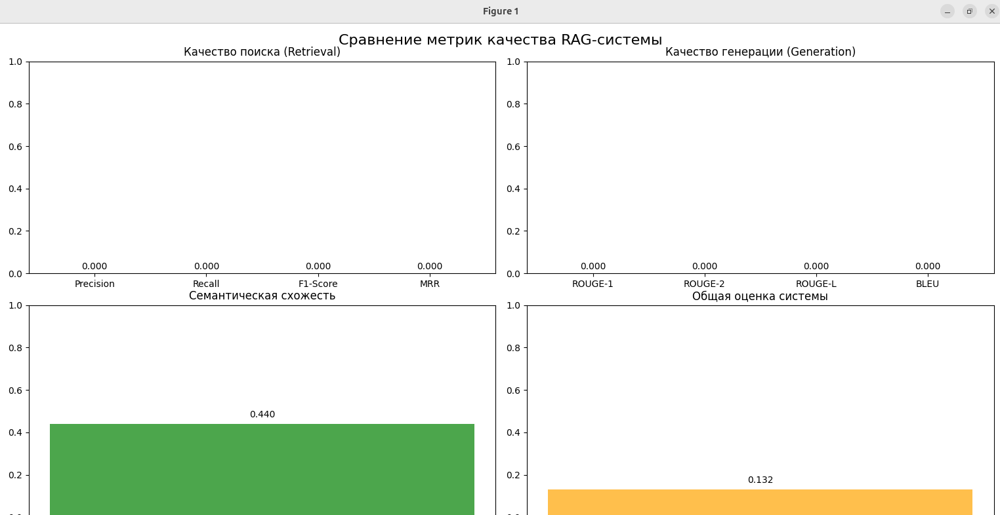 \
Рисунок 17 - Распаковка и запуск Apache Jena Fuseki

9. В Apache Jena Fuseki создан датасет, загружены RDF данные, выполнен SPARQL запрос с получением подсчёта всех триплетов;
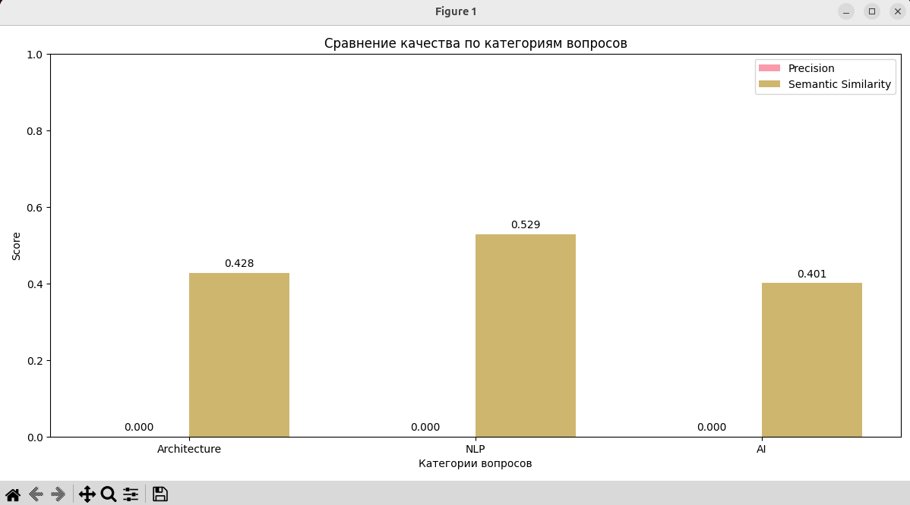 \
Рисунок 18 - Создание датасета \
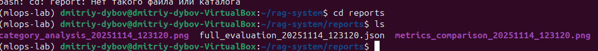 \
Рисунок 19 - Загрузка данных \
 \
 \
Рисунок 20 - Выполнение запроса

11. Написаны и выполнены запросы в sparql_queries.py, получены табличные результаты и подсчёты триплетов;
 \
 \
 \
 \
 \
 \
Рисунок 21 - Полученные результаты

12. Установлены transformers, SPARQLWrapper, rdflib, openai; 
 \
Рисунок 22 - Установка новых пакетов

13. Написан скрипт генерации SPARQL из текста и проверена его работа;
14. При выполнении скрипта возникли проблемы со скачиванием модели, поэтому они установдены вручную; \
 \
Рисунок 23 - Ошибка скачивания модели

15. При выполнении кода возникла ошибка "Out Of Memory" из-за недостатка оперативной памяти;
 \
Рисунок 24 - Ошибка Out Of Memory

17. Поскольку увеличить количество RAM не является возможным на данный момент, для предотвращения ошибки произведены попытки использования альтернативной модели с меньшей требовательностью и использования модели в щадящем режиме; \
 \
Рисунок 25 - Использование альтернативной модели \
 \
Рисунок 26 - Использование требовательной модели в щадящем

##### Тестирование
- [x] Модульные тесты - tests/test_pipeline.py проверяет корректность интеграции retriever -> generator.
- [x] Интеграционные тесты - запуск end‑to‑end на тестовой выборке.
- [x] Нагрузочные тесты - базовый стресс‑тест (параллельные запросы) показал деградацию при >50 concurrent requests на CPU; рекомендовано масштабирование на GPU/cluster.

##### Ключевые файлы
- documents/ -	исходные документы и предобработанные фрагменты
- retriever/vector_store.py -	векторное хранилище (FAISS wrapper)
- generator/llm_client.py	- клиент для LLM (генерация)
- pipeline/rag_pipeline.py	- основной RAG‑пайплайн
- evaluation/	- скрипты для оценки и визуализации

##### Выводы
В процессе выполнения лабораторной работы №6 были освоены базовые принципы построения RAG (Retrieval-Augmented Generation) систем путем интеграции векторного поиска и языковых моделей; продвинутых техник настройки и оптимизации языковых моделей для использования в качестве генеративного компонента RAG-системы; реализации полного конвейера RAG-системы, интегрирующего семантического поиска и генерации ответов; методов и метрик для комплексной оценки качества RAG-системы. Получены практические навыки разработки работающего прототипа системы, способной находить релевантную информацию в базе знаний и генерировать осмысленные ответы на основе извлеченного контекста; работы с различными архитектурами моделей, оптимизации промптинга и оценки качества генерации; проектирования надежных пайплайнов, обработку ошибок, мониторинг производительности и оптимизацию взаимодействия между компонентами системы; проведения объективного тестирования ретривера и генератора, анализирования результатов и выявления направления для улучшения системы.

##### Приложения
- Скрипты main.py, test_rag_system.py, documents/tech_docs.py, retriever/vector_store.py, generator/llm_client.py находятся в папке в lab-6-1.
- Скрипты main_optimized.py, generate_report, retriever/vector_store.py, gdocuments/tech_docs.py и generator/* находятся в папке в lab-6-2.
- Скрипты pipeline/rag_pipeline.py, api/pipeline_service.py, config/pipeline_config.py, tests/test_pipeline.py находятся в папке в lab-6-3.
- Скрипты evaluation/* и run_evaluation.py, а также папка с полученными отчётами в папке rag-system/reports находятся в папке в lab-6-4;
- Скриншоты помещены в папку report.
